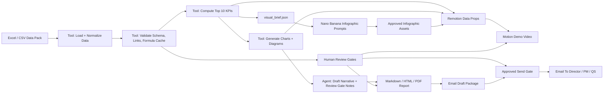

# Monthly Report Visual Demo Workflow Design

## Demo Goal

Turn the construction monthly report automation into a visual teaching demo that shows how WAT works:

- Workflow: repeatable monthly report SOP and review gates.
- Agent: interprets construction risk, chooses narratives, and stops for review.
- Tools: deterministic Python reads Excel, validates data, computes KPIs, draws charts, renders reports, and exports assets for infographic/video.

The demo should feel like a director/PM dashboard, not a raw Excel summary. The central story is:

`RFI/design clash -> progress delay -> critical milestone impact -> procurement/commercial/safety risk -> human review gates -> approved email distribution`.

## Top 10 KPI / Metric Storyboard

| Rank | KPI / Metric | Current Demo Value | Why It Matters | Best Visual |
| --- | --- | --- | --- | --- |
| 1 | Overall Progress Variance | Planned 57%, Actual 52%, Variance -5% | Fastest executive signal for project health | Gauge + planned/actual delta |
| 2 | Red / Yellow Progress Items | 2 Red, 2 Yellow, 1 Data Gap | Shows where site production needs action | Zone heatmap + exception cards |
| 3 | Critical Path Delay | M-013 +14 days, M-006 +10 days, M-012 +9 days | Director-level programme risk | Timeline / delay waterfall |
| 4 | RFI / Submission Bottleneck | RFI-034, 6 days open/overdue, 10-day programme impact | Explains root cause, not just symptoms | Dependency flow diagram |
| 5 | Procurement Delivery Risk | MAT-024 +10 days Red, MAT-021 +9 days Yellow | Long-lead materials threaten programme | Long-lead item risk lane |
| 6 | Safety / Quality Exceptions | 1 Red safety item, 4 Yellow exceptions | Cannot publish final report without safety review | Safety exception panel |
| 7 | Commercial GP vs Objective | Current GP HK$3.05M, HK$0.37M below objective | Links operations risk to margin | Commercial scorecard |
| 8 | Risk Exposure Movement | HK$1.2M, +HK$0.6M month-on-month | Shows risk trend worsening | Trend arrow + risk exposure bar |
| 9 | Open Decision Items | 3 Red, 4 Yellow, 1 Data Gap | Converts report into management actions | Decision matrix by reviewer |
| 10 | Data Quality / Review Blockers | 4 blockers, 33 warnings | Demonstrates governance and AI safety | Review gate funnel |

## Recommended Visual System

Use three visual layers instead of only ordinary charts:

1. **Executive KPI Strip**
   - 10 compact KPI tiles.
   - Each tile has value, trend/variance, RAG color, owner/reviewer.
   - Use ODD orange for action, magenta for brand emphasis, red/amber/green for risk.

2. **Causal Story Diagram**
   - Main visual: `RFI-034 -> PRG-003 / PRG-012 -> M-006 / M-013 -> ISS-001 / ISS-002`.
   - Show RFI/design clash as the root node.
   - Show progress and milestone impacts as connected nodes.
   - Show required reviewers at the end: PM, Technical Manager, Project Director.

3. **Evidence And Governance Layer**
   - Data gap cards: PRG-006 missing actual progress, MAT-026 missing forecast delivery, RFI-041 missing due date.
   - Review gate status: pending, blocked, ready for review.
   - Explain that AI must not invent missing values.

## Static Diagram / Chart Set

For the next implementation pass, expand report assets from 6 charts to 12 visuals:

| Asset | Type | Output Filename | Source |
| --- | --- | --- | --- |
| Executive KPI Strip | KPI tile dashboard | `executive_kpi_strip.png` | all metrics |
| Project Health Radar | Radar/spider or score wheel | `project_health_radar.png` | progress, programme, RFI, procurement, safety, commercial |
| Root Cause Flow | Node-link diagram | `rfi_034_root_cause_flow.png` | RFI + progress + milestone + risk links |
| Progress Heatmap | Zone/trade heatmap | `progress_heatmap.png` | `01_Area_Progress` |
| Critical Delay Timeline | Timeline/waterfall | `critical_delay_timeline.png` | `02_Programme_Milestones` |
| RFI Aging Bubble | Bubble chart | `rfi_aging_bubble.png` | `03_Submission_RFI` |
| Procurement Risk Lane | Long-lead lane chart | `procurement_risk_lane.png` | `04_Procurement` |
| Safety Exception Board | Safety cards | `safety_exception_board.png` | `05_Safety_Quality` |
| Commercial Scorecard | Scorecard + movement arrows | `commercial_scorecard.png` | `06_Commercial_Cost` |
| Decision Matrix | Owner x severity matrix | `decision_matrix.png` | `07_Risk_Action_Decision` |
| Review Gate Funnel | Governance funnel | `review_gate_funnel.png` | `09_Review_Gates` + validation |
| AI Confidence / Data Quality | Data quality matrix | `data_quality_matrix.png` | validation issues |

## Nano Banana / Infographic Workflow

Use Nano Banana-style image generation for editorial infographic panels, not for source-of-truth calculations.

Pipeline:

1. Python exports `visual_brief.json` with top 10 KPIs, exact values, RAG colors, and chart copy.
2. Agent converts `visual_brief.json` into `infographic_prompts.md`.
3. Nano Banana generates 2-4 hero infographic panels.
4. Human checks factual numbers and wording.
5. Approved images are copied into `outputs/monthly_report/<period>/assets/infographics/`.
6. Markdown/HTML/PDF and Remotion video reference only approved generated images.

Prompt pattern:

```text
Create a premium executive construction project monthly report infographic for OpenDeedigital.
Use a clean Hong Kong commercial tower E&M / fit-out project visual style.
Brand colors: vivid orange #F36B15, magenta #9B0A68, deep neutral #231F20.
Include the following exact KPI values, do not invent numbers:
- Overall progress: Planned 57%, Actual 52%, Variance -5%.
- Critical path delays: M-013 +14 days, M-006 +10 days, M-012 +9 days.
- RFI bottleneck: RFI-034, 6 days open/overdue, 10-day programme impact.
- Commercial: Current GP HK$3.05M, HK$0.37M below objective, risk exposure HK$1.2M.
Visual format: 16:9 dashboard infographic, construction project control room style,
clear KPI tiles, dependency arrows, RAG colors, no fake photos, no extra numbers.
```

Recommended generated panels:

- Panel 1: Executive health overview.
- Panel 2: RFI-034 root cause and programme delay chain.
- Panel 3: Commercial and risk exposure impact.
- Panel 4: Review gate / human-in-the-loop governance.

## Remotion / Motion Workflow

Use Remotion for a 60-75 second motion version of the demo. The video should explain the workflow, not just animate charts.

Composition:

| Scene | Duration | Purpose | Motion Idea |
| --- | --- | --- | --- |
| 1. ODD Branded Opening | 5s | Introduce project/month/status | Logo reveal + report title |
| 2. WAT Pipeline | 8s | Explain Workflow-Agent-Tools | Three-layer architecture diagram animates left to right |
| 3. KPI Pulse | 10s | Show top 10 KPI strip | KPI tiles count up and RAG badges appear |
| 4. Root Cause Chain | 12s | Teach the core insight | RFI-034 node lights up, arrows flow to PRG-003, PRG-012, M-006, M-013 |
| 5. Risk Dashboard | 10s | Show procurement/safety/commercial | Three panels slide in with MAT-021, SQ-004, GP risk |
| 6. Review Gates | 8s | Show human-in-the-loop | Gates flip from pending to blocked/ready |
| 7. Output Package | 7s | Show final deliverables | Markdown, HTML, PDF, charts, JSON cards fan out |
| 8. Close | 5s | Emphasize governance | “Draft with blockers until reviewed” |
| 9. Distribution | 5s | Show controlled email issue | Email draft appears, approval stamp unlocks send |

Remotion data inputs:

- `outputs/monthly_report/<period>/metrics.json`
- `outputs/monthly_report/<period>/review_gate_status.json`
- `outputs/monthly_report/<period>/assets/*.png`
- `brand_assets/ODD Logo.png`

Recommended implementation:

- Create `motion/monthly-report-demo/` as a separate Remotion app.
- Add `src/data/monthly-report.json` generated from `metrics.json`.
- Build reusable components: `KpiTile`, `RagBadge`, `DependencyNode`, `ReviewGateCard`, `ChartFrame`.
- Render still checks first at frames 30, 300, 900, then render MP4.

## Updated WAT Workflow For Demo



## Implementation Backlog

1. Add `tools/select_top_kpis.py`.
   - Reads `metrics.json`.
   - Produces ranked top 10 KPI records with value, trend, RAG, owner, source, and explanation.

2. Add `tools/generate_visual_brief.py`.
   - Produces `visual_brief.json` and `infographic_prompts.md`.
   - Includes Nano Banana prompts with exact values.

3. Upgrade `tools/generate_report_charts.py`.
   - Add KPI strip, causal flow, delay timeline, review gate funnel, and decision matrix.
   - Keep existing charts as supporting visuals.

4. Upgrade `tools/render_monthly_report.py`.
   - Add a “Visual Executive Dashboard” section before detailed tables.
   - Embed infographic panels only if approved image files exist.

5. Create Remotion demo project.
   - Input from report JSON and approved visual assets.
   - Output MP4 and optional animated GIF preview.

6. Add visual QA.
   - Verify every PNG is nonblank.
   - Verify ODD logo exists in report and motion opening.
   - Verify all displayed KPI values match `metrics.json`.
   - Run Gemini external QC against representative Remotion frames and save an acceptance report.

7. Add email distribution demo.
   - Generate `email_draft.md`, `email_draft.html`, `.eml`, and `email_manifest.json`.
   - Attach PDF by default and link to HTML/Markdown where appropriate.
   - Require human approval before real SMTP/Gmail sending.
   - Add a Remotion scene showing the email remains locked while blockers exist.

## Human Review Gates For Visual Assets

- KPI value gate: every number in infographic/video must match `metrics.json`.
- Claims wording gate: RFI, EOT, VO, GP, cashflow, and risk exposure wording reviewed by PM/QS.
- Safety gate: red safety item presentation reviewed by Safety Officer.
- Brand gate: ODD logo, color, and tone approved before publishing.
- AI image gate: generated infographic must not introduce fake site photos, fake drawings, fake people, or unverified evidence.
- Email gate: recipients, subject, attachments, claims wording, and final report status reviewed before sending.
- External model QC gate: Gemini or another vision-capable model reviews frames against visual quality, data fidelity, governance clarity, and construction-native tone.
